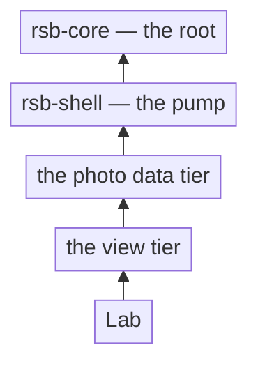

# RSB

**I'm building Lab: a free, professional-grade photo editor for the desktop.**

Lab runs on your machine, stores its work on your disk, and answers to no one
but the person using it. No subscriptions. No telemetry. No cloud lock-in.
Photography is the work I know well, and it is where professional tools have
drifted toward subscription rentals, cloud-dependent workflows, and
surveillance by default. Lab goes the other direction.

The other half of the work is the record: every load-bearing decision behind
the code is public — argued, recorded, and held to.

- [rsb/lab](https://github.com/rsb/lab) — the code: one Cargo workspace,
  small crates, enforced boundaries. GPL-3.0-or-later.
- [rsb.sh](https://rsb.sh) — the engineering record: decisions, standards,
  architecture, and the why.
- [app.rsb-lab.com](https://app.rsb-lab.com) — the product home.

## The shape of it

Most general at the top, most specific at the bottom; references point up.
It is a DAG, not a tree — the full story is at
[rsb.sh/architecture](https://rsb.sh/architecture).
